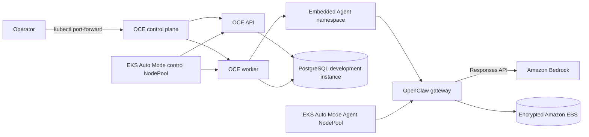

# Architecture

The walkthrough keeps the OCE API private and reaches it through a local
Kubernetes port-forward. The development database runs in the cluster only to
make the evaluation replayable. Use a private managed PostgreSQL database for a
production design.

Auto Mode supplies nodes for pending Pods and replaces disrupted nodes. OCE
owns Agent revisions, credentials, Kubernetes namespaces, and runtime
lifecycle. Auto Mode does not change OCE replica counts or make its API and
worker highly available.

See [Tenant isolation](TENANT_ISOLATION.md) for the shared-cluster trust
boundary. See [Capacity, persistence, and cost controls](CAPACITY_AND_COST.md)
for node provisioning, replicas, EBS topology, quotas, and budgets.
